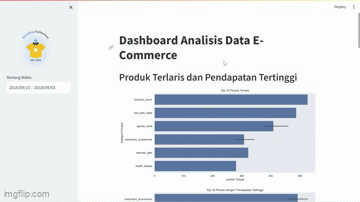

# Analisis Data E-Commerce Publik dengan Python - Dicoding



[Akses Dashboard](https://dicoding-data-analyst-ecommerce-naldi.streamlit.app/)

## Daftar Isi
- [Tinjauan Umum](#tinjauan-umum)
- [Fitur Utama](#fitur-utama)
- [Struktur Proyek](#struktur-proyek)
- [Instalasi](#instalasi)
- [Penggunaan](#penggunaan)
- [Sumber Data](#sumber-data)
- [Kontributor](#kontributor)


## Tinjauan Umum
Proyek ini adalah proyek analisis dan visualisasi data yang berfokus pada data publik e-commerce. Ini mencakup kode untuk data wrangling, analisis data eksplorasi (EDA), dan dashboard Streamlit untuk eksplorasi data interaktif. Proyek ini bertujuan untuk menganalisis data pada E-Commerce Public Dataset dari Dicoding dan menampilkannya dalam dashboard yang mudah dipahami.

## Fitur Utama
* **Analisis Produk:** Menampilkan produk terlaris dan produk dengan pendapatan tertinggi.
* **Tren Penjualan:**  Menampilkan tren penjualan dari waktu ke waktu.
* **Pola Musiman:**  Menganalisis pola musiman dalam penjualan.
* **Demografi Pelanggan:** Menampilkan  distribusi pelanggan berdasarkan negara.
* **Pelanggan Teratas:**  Mengidentifikasi pelanggan dengan pembelian terbanyak.

## Struktur Proyek
- `dashboard/`: Berisi file `dashboard.py` untuk menjalankan aplikasi Streamlit.
- `E-Commerce Public Dataset/`: Berisi file CSV data mentah.
- `Proyek_Analisis_Data.ipynb`: Jupyter Notebook untuk analisis data.
- `README.md`: File dokumentasi ini.
- `requirements.txt`: Daftar library yang dibutuhkan.

## Instalasi
1. Klon repositori ini: `git clone https://github.com/xebec51/Dicoding-Proyek-Analisis-Data.git`
2. Buka direktori: `cd Dicoding-Proyek-Analisis-Data`
3. Install library: `pip install -r requirements.txt`

## Penggunaan
1. **Data Wrangling & EDA:**  Lihat `Proyek_Analisis_Data.ipynb` untuk proses data wrangling dan analisis data eksplorasi.
2. **Jalankan Dashboard:**
   ```bash
   cd dashboard
   streamlit run dashboard.py
   ```

Akses di browser: http://localhost:8501

## Sumber Data

Proyek ini menggunakan E-Commerce Public Dataset dari Dicoding Indonesia, yang disediakan sebagai bagian dari submission Proyek Akhir pada kelas [Belajar Analisis Data dengan Python's Final Project](https://drive.google.com/file/d/1MsAjPM7oKtVfJL_wRp1qmCajtSG1mdcK/view). Dataset ini berisi data transaksi penjualan dari sebuah platform e-commerce, yang digunakan untuk analisis dan visualisasi dalam proyek ini. Sumber data ini disediakan oleh [Dicoding](https://www.dicoding.com/).

## Kontributor

* Muh. Rinaldi Ruslan